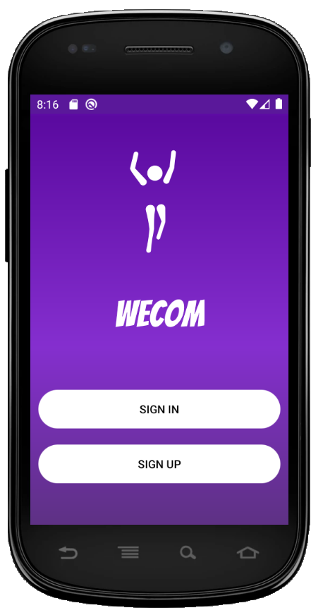
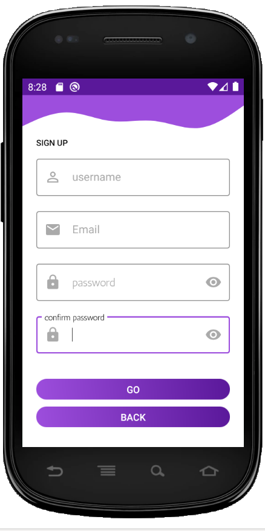
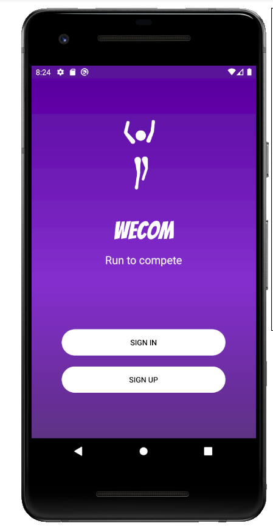
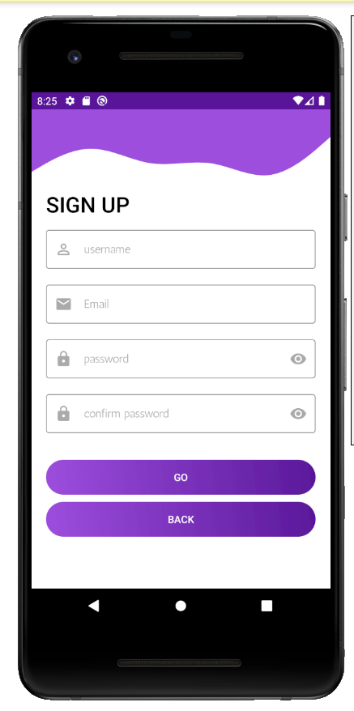
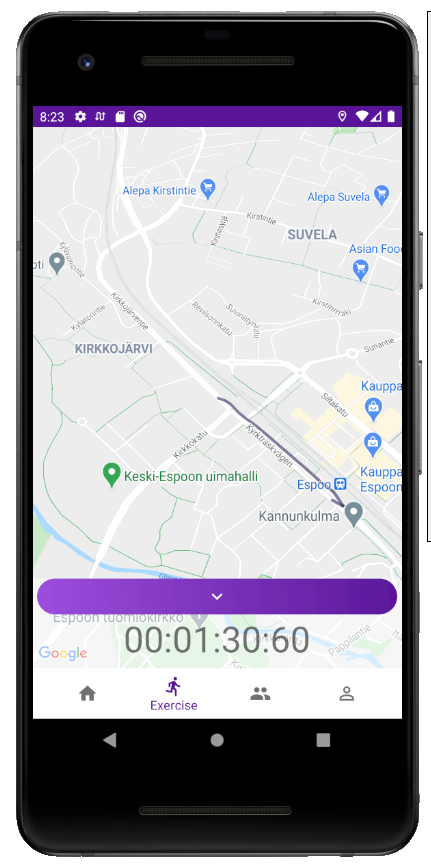
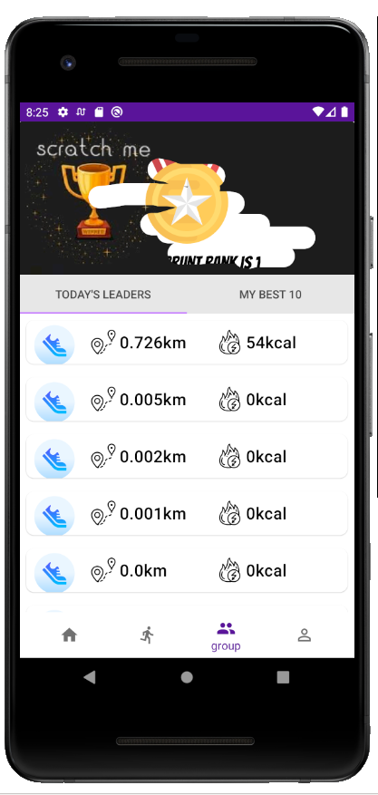
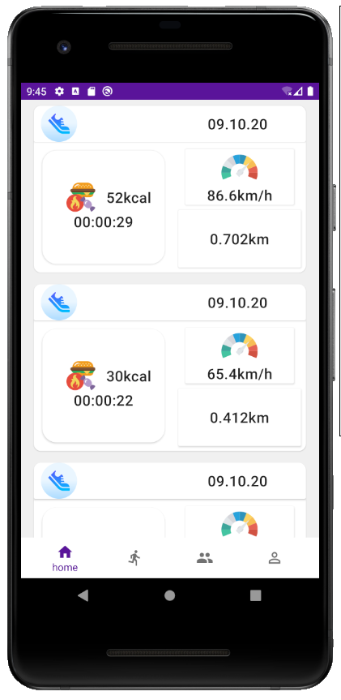

# wecom - Android-App      

 ## Discription 
 -------------------------------------------------------
. This app is a usefull light-weight android exercise tracking and competition App.
. the app uses google map API to track users location. 
. using this app users can see thier runing distnace, direction, time , speed and the calories they have burned 
. using the data from thier exercise the App let users to compete with other users in thier cities.
. the app compete users on two categories. the first one is based on the distance they run, so the longer they run the higher probability to be the winner. 
  the second one is based on the total amount of calories burned.
.everyday the winner board will be reseted, so users can compete to be the day's winner. 

---

 ## Features     
    
 -----------------------------------------------------
 
- The app has a special feature of instant prizing.
- The app uses both Room and Firebase Firestore for an offline and online data access 
- The app is build using MVVM architecture 
- The app uses coroutines for background tasks
- The app uses Hilt for dependency Injection
- the app use foregroind service 
- The app uses location sensor
- The app is written in Kotlin 

 
 |  Min SDK Version | Version Name  | SDK Version |
 | ---------------- |:-------------:| ----------  |
 |  23              |  1.0          |      30     |

 
 
 - Instant Prizing    
 - lottie animations 
 - flat icons 
 - Jetpack navigation components  
 - transition animation
 - material design components
 - scrachview for revealing user competition rank 

---------------------------------------------------------

## Design pattern /architecture

- Model View ViewModel

-----------------------------------------------------------

## External Librarys 

 
 |  Librarys           |           usage                                     | 
 | ----------------    |:----------------------------------------------------|
 | scarachview         |    for displaying user rank                         |
 |-----------------------------------------------------------------------------|
 |  LottieFiels        |  for animation                                      |
 |-----------------------------------------------------------------------------|
 |  material design    |  for material components                            |
 |-----------------------------------------------------------------------------|
 |  Dagger-Hilt        |  for dependency-Injection                           |
 |-----------------------------------------------------------------------------|
 

## photos

---------------------

  
 

   

